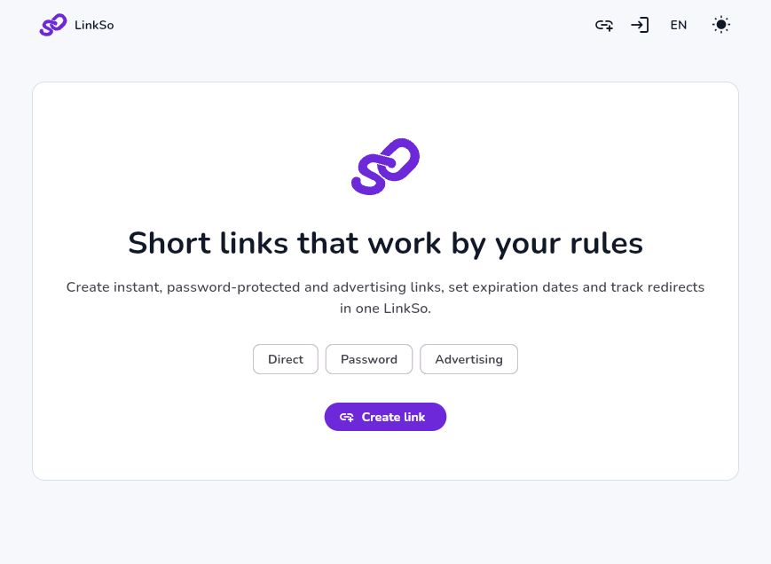
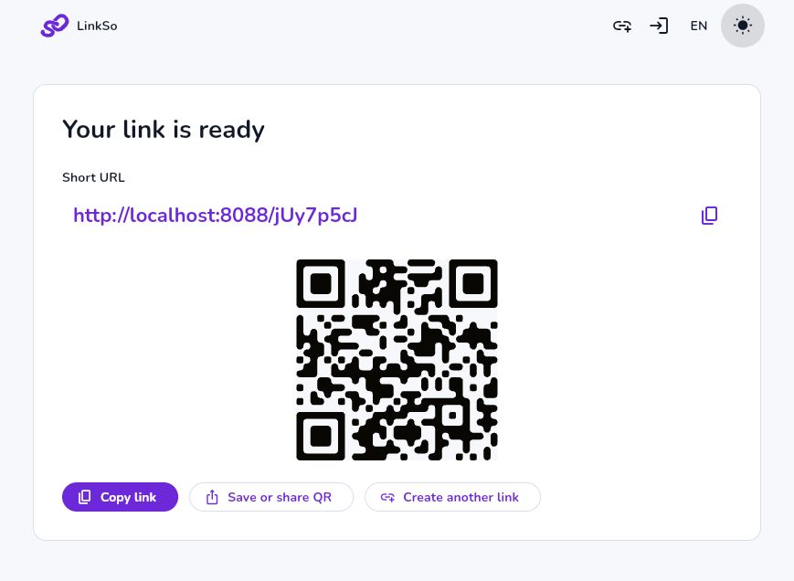

# LinkSo

LinkSo is a short-link service with direct, password-protected and five-second advertising redirects. A shared Flutter app runs on Web, Android and iOS; the API is built with Rust, Axum and PostgreSQL.

## Features

- Create direct, password-protected and advertising short links with custom slugs, expiration, titles and tags.
- Manage links, enable or disable them, export QR codes and review owner-scoped analytics.
- Register accounts, verify email, recover access and manage active sessions and profile settings.
- Use responsive Web, Android and iOS clients with English/Russian localization and light/dark themes.
- Protect redirects with server-side timers, one-time tickets, rate limits, moderation and privacy-first aggregated metrics.
- Run the complete stack with PostgreSQL, Mailpit, Rust and Nginx through Docker Compose.

## Screenshots

### Home

### Created link

The screenshots use local demonstration links, not publicly hosted short URLs.

## Technology stack

| Layer | Technology |
| --- | --- |
| Client | Flutter, Dart, Material 3 |
| API and redirects | Rust, Axum, SQLx |
| Data | PostgreSQL |
| Web delivery | Nginx, WebAssembly/SkWasm with JavaScript fallback |
| Local email | Mailpit |
| Operations | Docker, Docker Compose, Prometheus metrics |

## Components

- [Flutter client](linkso_client/README.md)
- [Rust server](linkso_server/README.md)
- [OpenAPI contract](linkso_server/openapi.yaml)

## Project documentation

- [Project structure](docs/PROJECT_STRUCTURE.md)
- [Linux deployment](docs/DEPLOYMENT.md)
